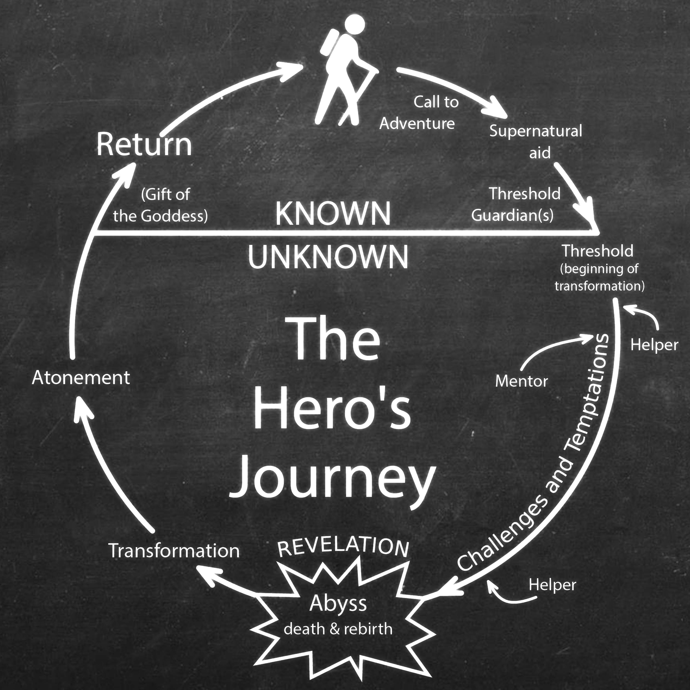

# XJ music demos

Example projects demonstrating the [XJ music](https://xjmusic.com) workstation and engine

### Getting started

First, [Download the XJ music workstation](https://xjmusic.com/download) and follow
the [installation instructions](https://docs.xjmusic.com/installation/).

Then, read the [getting started documentation](https://docs.xjmusic.com/getting-started/) which will show you how to
create one of our Demo projects to get started checking out the workstation right away.

Alternatively, when this repository is cloned onto your local disk, you can use the XJ music workstation to open one of
the demos here.

| <h2 align="center">Hero's Journey</h2> | <h2 align="center">Deep House</h2>           |
|--------------------------------------------------------------------------------------------------------------------------|-------------------------------------------------------------------------------------------------------------------|
| <h2 align="center">Lofi Hip Hop</h2>        | <h2 align="center">Ambient Flow</h2> |

